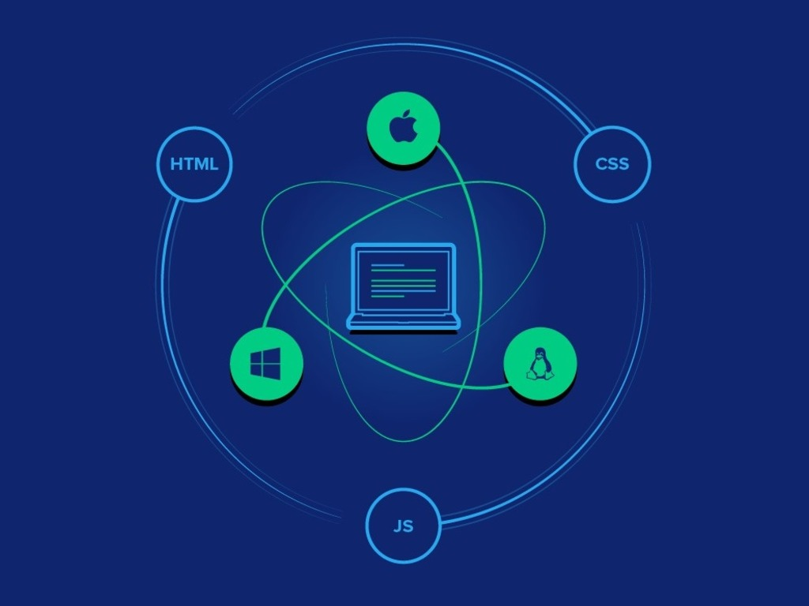
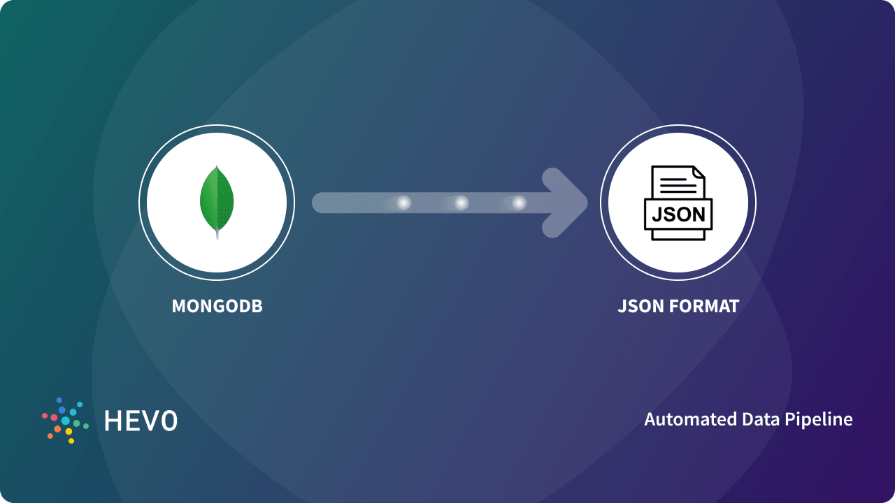
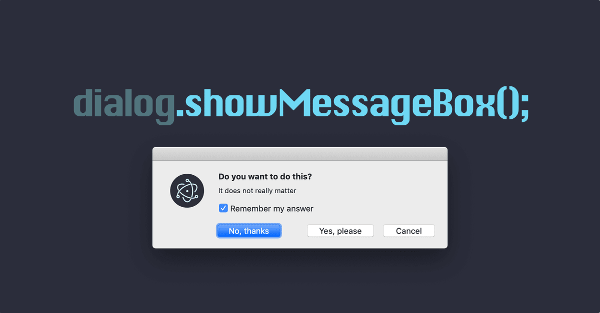

# Devil-s_Eye portfolio

# All about the devil’s vision 

- Before students used to attend classes physically attending the classes and lecturers used to manually teach them while keeping an eye on them. But, due to the era of new normal we are here using the advantage of the internet and attending classes through Zoom video conferencing. Where a student needs to join the class through a link and have to keep their Camera and microphone on during the class.
- But students will be students whatever the era it might be. Therefore, during the zoom sessions the student will switch off their camera and microphone and that is the new normal type of bunking the classes. Having said that, the mentor will be unaware of the status of the student. Finding if the student is attending the class or not is a tough task to do. -Therefore, to overcome this problem we are developing an application called “DEVIL’S EYE”, which keeps popping certain questions in periodical timings so as to make sure if the student is attentive during the class or not. If they are attentive then they will answer the right questions and get the attendance of that session. If not, they will miss their attendance.

# Sprint-1: Explored Electron Application

- Devil’s eye is a desktop application. We have decided to design it in an electron app using Javascript . As I have little knowledge in react and javascript in order to design better I learned certain Javascript concepts which are useful to the project.
- As I started working on the project it has become tougher than it looked. I have faced the biggest challenge to integrate changes done in Java script to reflect in the main process where the electron apps can work.
- Inorder to get more understanding and grip on the project, I have referenced electron documentation and watched some youtube videos and had a firm knowledge on IPC main and renderer process and successfully the hello-world page is designed in electron.

# Sprint-2: Sign In process

- To start with the project, our team and I have decided to work on the Sign-In page first for our application.
- With which the students need to sign-in into the application with an MSIT email.
- For the Sign-in application, we used MongoDB for database collection where we stored all MSIT student’s details for instance, student name, email-Id etc in a collections database with their respective ID numbers.
- Whenever an user signs in into a devil’s eye application it will send an API which checks whether it is a valid email or not by checking in the database and returns a response.
- Based on the response i.e if the user is legitimate then the application starts loading to the next page where the mentors page will be loaded.
- If the user is not legitimate it will ask the user to try again with a valid e-mail ID then the page gets loaded from there.

# Sprint-3: Database in MongoDB

- MongoDB is an open-source document database and leading NoSQL database. MongoDB is written in C++. This tutorial will give you great understanding on MongoDB concepts needed to create and deploy a highly scalable and performance-oriented database.
- Initially I faced difficulty while working on databases and how to fetch the data from the database on our local machines.
- After exploring, our team and I decided to use the AWS lambda function for response. We used an API key for response on local machines.
- Similarly, for the mentors list I have used stored IT and SOFT SKILLS Mentor details.
- After loading mentor details, I worked on DIALOG BOX POP UP which is the soul of the project. Initially dialog box pop up occurred not on the current window.
- Finally, after getting the whole understanding on the electron and how to get the popup box on the particular page which will be embedded in the electron application only.

# Sprint-4: Generate DialogBox at random time

- Initially, we struggled to integrate the sign-in page into the electron application. I am stuck in the middle by the integration, watched several videos and understood the basic concepts of pages to integrate and adjust with the electron technologies. Later, our team and I had successfully implemented the Sign-in page.
Now, as we discussed earlier, to take the attendance of the student in order to understand if the student is particularly attentive in the class or not. 
 
- Speaking of which, I have come up with the idea of generating popup messages which show up on the student screen at random time to check the whereabouts of the students. 
- Generally, the message asks the student whether he is attentive or not. If yes, the student will click the right button if not the student will tend to click the wrong button or in the least scenario the student will miss to answer the popup message.
 
- If the student selects the right answer then the student will get attendance orelse the student will lose the attendance for that particular session.

- Having said that, I have tried generating the pop messages in the electron app as a trail on the current working window. Later, I have tried to generate the same at regular intervals. To do so, I have used the random library to generate the pop messages at regular intervals on the screen of the students. 
 
- After generating the pop messages successfully. Next, I tried to disappear the message after 10 sec. But, the method is not feasible with the electron technology. 

# Sprint-5: Hu-mongoose(module of MongoDB)

- We made a schema in which we have details of every student’s daily basis information, including the number of pop-ups that have been generated and these pop-ups answered by each student.
- These details are implemented into the mongoDB where we have faced several issues. For example, we were clueless about how to traverse the data of nested schema. We have come up with the solution by referring to several resources like, nodechef, stackOverflow, youtube and mongoose official documentation.
- After succeeding in traversing the data we faced another issue while inserting the data with the MongoDB client. We have come up with the solution by referring to a plethora of resources and also mentor support. We successfully inserted the data into the database in the JSON format.
- We have also added the styling of our login page application using CSS.

# Sprint-6: Back and Front

- As I mentioned earlier, we were facing issues while traversing the data during the data retrieval. So, we have seeked help from our mentor for the solution by referring to a plethora of resources.
- We successfully inserted the data into the database in the JSON format by using mongoose.

- To test the above schema, we have used different mail-IDs where we have faced the issue of the duplicate data in the schema. So, to overcome this, we have made the necessary changes in the code and resolved it. Later, we have tested the same schema and it has worked as it was expected to be.

- While we were working on the backend there was certain work done in the front-end functionalities as well. To make the login page look esthetic and minimalistic we have used plain background and have added a certain CSS style to make the login page simple
- Along with that, we have retrieved the data from the database and tried to insert the functionalities of login and logout from the application side.

# Sprint-7: Rendered Data with dashboard

- As we completed login and logout also few other functionalities as well. In this week's sprint we have completed the design of the dashboard by using CSS styling for the application. We have written the schema. We tested the schema in the electron and ran it while the failures were written and had to come up with the solutions to those errors. Also, we have fetched the data from MongoDB and read the data and inserted it into the electron. 
- Similarly, we also completed the SS and styling for the Login page. But we found certain difficulty while traversing the data from the MongoDB to the electron app. Also, faced difficulty while representing the data in the tabular form.
- Later, half of the part was done which was completing the SS and styling for the Login page and the traversing of the data from the MongoDB to the electron app. But while designing the dashboard and retrive the data from the database and include that in the electron by calling the API calls continued facing difficulty while representing the data in the tabular form

# Sprint-8: The Final Product testing

- As we walk through the whole process we have got the necessary pages and the application purpose right. Now, is to design the pages, add the framework on the desktop application and the dashboard.
- Including that, we have successfully processed the students attendance data from the MongoDB to the dashboard and also can visually look at the attendance of the students.
- We have tested our application which includes certain edge cases for example, if the students join after or before the allotted session timings the application will not work.
- Later, we alongside have started working on the technical documentation of the application and prepared a technical presentation for the better understanding of the application requirements to the panel.

